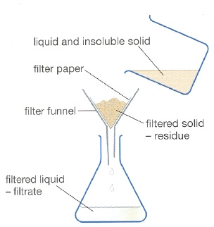
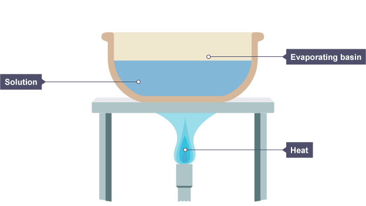
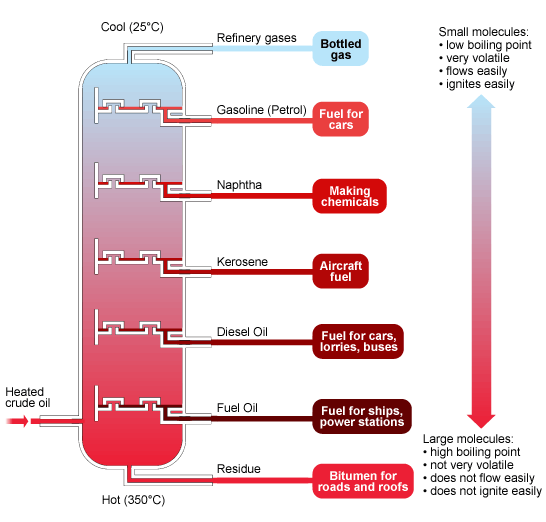
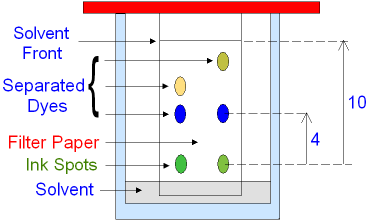

# Chapter 2 Experiemental techniques

## Separation

### List of Separation Techniques

1. Magnetic Attraction: **Separate magntic material**
 *e.g. cobalt from wood*
2. Filtration: **Get solid from a solid mixture**
 *e.g. sand from water*
 
3. Evaporation **Separate a disolved solid that does not decompose on heat**
 *e.g CuSO4*
 
4. Simple Distillation **Separate a pure liquid from a mixture of two liquid**
 
5. Fractional Distillation **Separate liquid with different boiling points**
 
6. Chromatography **Separate different color components**
 

### Chromatography
1. **Step 1** Apply a small but concentrated spot of the solution on a piece of chromatography paper
2. **Step 2** Suspend the chromatography paper in a beaker or boiling tube of solvent with the spot above the level of the solvent
3. **Step 3** Separation takes place because some components of the liquid mixture travel at a **faster** pace than other components on the paper or any other aborbent material

## Purity and b.p and m.p
The greater the amount of an impurity, the bigger the **differences** from the true melting point and boiling point.

