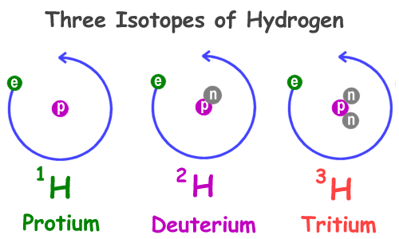
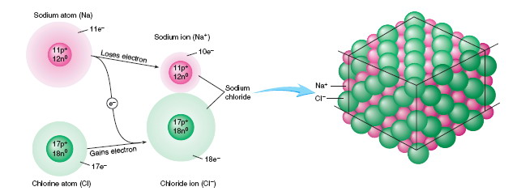
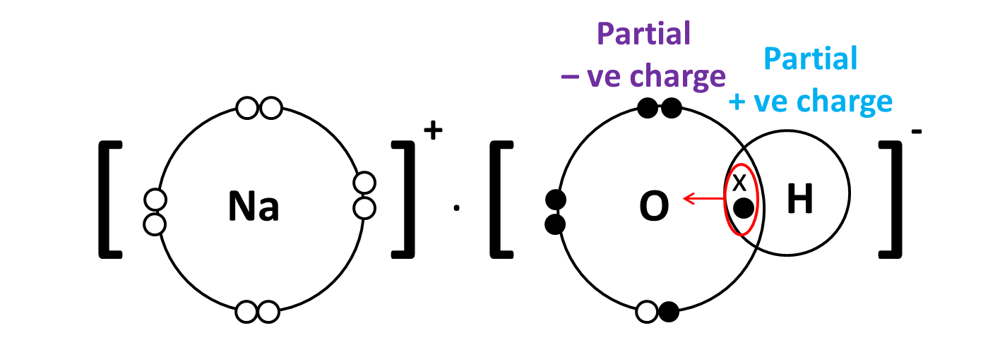
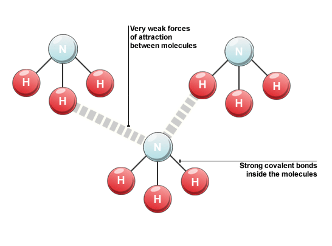
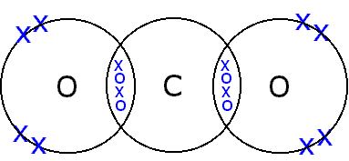
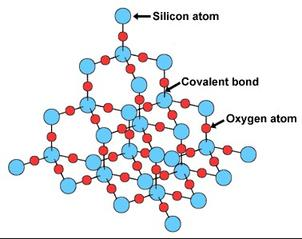

#Chapter 3 Atoms elements and compounds
**TIP: Change the Zoom percentage if you think the font is to small to read**

##Physical change & Chemical change
- A physical change in a substance doesn't change what the substance is. 
- In a chemical change where there is a chemical reaction, a new substance is formed and energy is either given off or absorbed.

##What is atom
- Describe the structure of an atom in terms of *electrons and a nucleus containing protons and neutrons.*

##What is isotope
- Isotopes are atoms of an element with the **normal number** of protons and **electrons**, but **different** numbers of neutrons.

##Form of ionic bonds
- Ionic bonds occur between **metals** and **non-metals**
- When metals react with non-metals, electrons are **transferred** from the **metal** atoms to the **non-metal** atoms, forming ions.

##The lattice structure of ionic compounds
- a regular arrangement of alternating positive and negative ions

##What is covalent bonds
- **non-metallic elements** form nonionic compounds using a different type of bonding called covalent bonding.

##The volatility, solubility and electrical conductivity

##The diagram of covalent bonds

##Giant Structure
1. Diamond
2. Graphite

##Usage of diamond and graphite
1. Diamond  -> cutting
2. Graphite -> lubricant

##The structure of Silicon(IV) Dioxide

