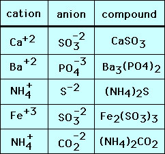
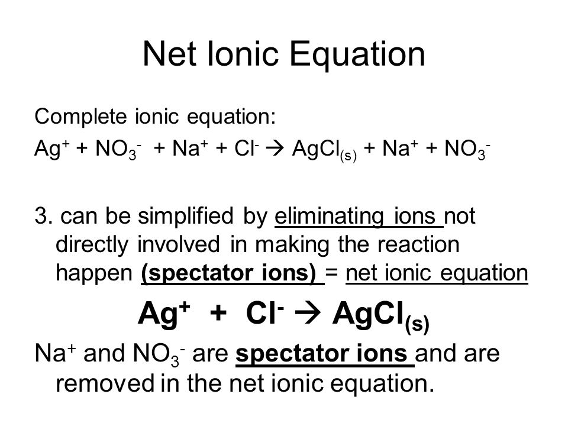
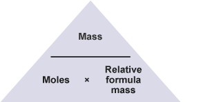
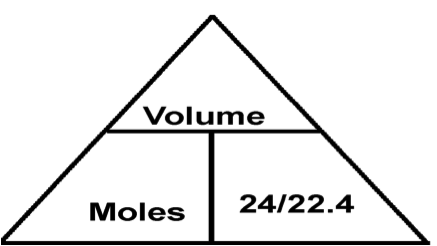
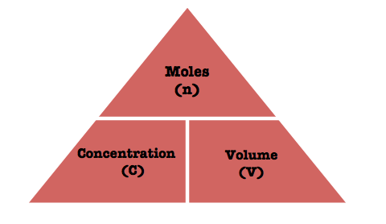

# Chapter 4 Stoichiometry

## Ionic compound formula

;

## Ionic equation

;

## What is relative atomic mass

- The ratio of the **average** mass of one atom of an element to one twelfth of the mass of an atom of **carbon-12**.

## What is relative molecular mass

- Sum of the relative atomic mass Mr

## What is mole
- A specific number of particles called Avogadro’s constant.

## Mole calculating formulas

;

;

;

----
[**Chaper 3**](chapter3.md) -- [**Chapter 5**](chapter5.md);

[Homepage](../../README.md)

