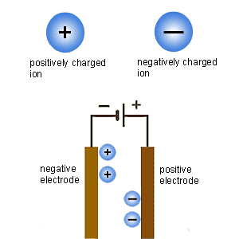
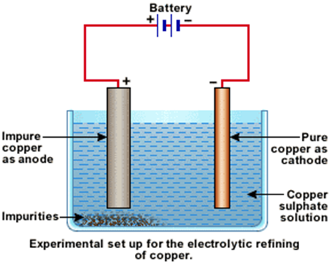
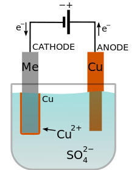
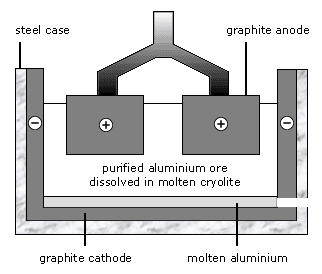

# Chapter 5 Electricity and chemistry

## Explain electrolysis

- Electrolysis is the chemical effect of electricity on **ionic** compounds, causing them to **break up** into **simpler** substances, usually elements.

## Products in the electolysis of

Compunds | Anode product | Cathod product
---------|---------------|---------------
Molten lead(II) Bromide | Bromine | Lead
Aqueous copper chlorine | Chlorine | Copper
Dilute sulfuric acid | Oxygen | Hydrogen

## Describe electrolysis

**Positively** charged ions move to the negative electrode during electrolysis. They receive electrons and are **reduced**.
**Negatively** charged ions move to the positive electrode during electrolysis. They lose electrons and are **oxidised**.

;

## Copper refining

;

## Describe electroplating

- Use electricity to coat one metal with another.

1. At the cathod: the object to be electroplated
2. At the anode: metak X(the metal you what to coat the object with)
3. Electrolyte: an aqueous solution of compound X

;

## Manufacture of aluminium

an aluminium **compound** with a **lower melting point** than aluminium oxide. The use of **cryolite** reduces some of the energy **costs** involved in extracting aluminium.

;

- **Oxygen** forms at the positive electrode
- Aluminium forms at the negative electrode

[**Chapter 4**](chapter4.md) -- [**Chapter6.md**](chapter6.md);

[Homepage](../../README.md)
