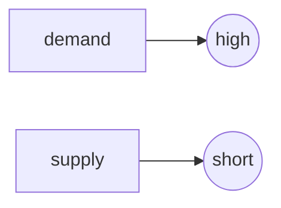
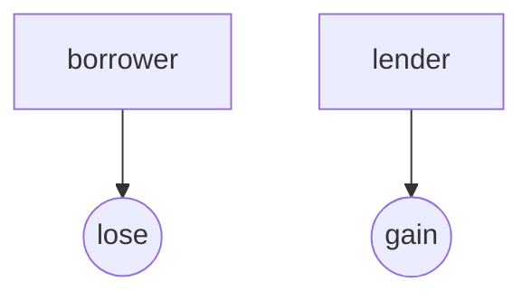

#IGCSE Economy 0455 Points Revision document
**Contents**

[TOC]
#Section I 1-3
##Unit-1 Scarcity
<span id="scarcity" />
##Unit-2 Factors of Production
<span id="factors_of_production" />
##Unit-3  Opportunity cost
<span id="opportunity_cost" />
Opportunity cost is the **best alternative** forgone


#Section II 4-13
##Unit-4 Market and Mixed Economies

###Market Economy

####Advantages of Market Economy

1. Consumer **sovereignty**(主权) (1) **consumers determine** the goods and services produced (1) producers make what **consumers want** (1)
2. May be **more choice** (1) people can decide who to work for (1) may be choice of suppliers (1)
3. May be **efficient** (1) due to **competition** (1) drive **down costs** (1) **lower prices** (1) profit **incentive** (1) ability to earn **high wage**s (1)

####Disadvantages of Market Economy

1. May be **inequality** of income (1) the rich can increase their earning potential through saving/receiving a better education (1) some vulnerable groups, e.g. the sick may find it difficult to earn an income (1)
2. Private sector **monopolies** may develop (1) these may charge **high prices** (1) reduce **quality** (1) restrict **choice** (1)
3. Decisions will be based on **private** costs and benefits (1) existence of **external costs** and benefits (1) can cause **inefficient** choices (1)
4. Certain **beneficial** products (**merit goods**) (1) may be **under-consumed** and so **underproduced** (1)
5. Certain **harmful** products (**demerit goods**) (1) may be **over-consumed** (1) and so **overproduced** (1)
6. Some products (**public goods**) (1) may **not be produced** (1) difficult to stop non-buyers consuming the product (1)
7. Advertising can **distort** choice (1) producers can **influence** what **consumers** want to buy (1)

##Unit-5 Equilibrium Price
<span id="equilibrium_price" />
##Unit-6 Change in Demand
<span id="demand" />
##Unit-7 Change in Supply
<span id="supply" />
##Unit-8 PED
<span id="ped" />

###The usage of PED for Government
1. Knowledge of PED would help a government estimate how much tax revenue (1) it may earn from indirect taxes/changes in indirect taxes (1) may earn more on products with inelastic demand (1).
2. Knowledge of PED may help a government to estimate how much of a subsidy to give (1) a subsidy will have more of an impact on quantity (1) if demand is elastic (1).
3. Knowledge of PED will help a government estimate how successful it may be in reducing consumption of a product (1) example, e.g. cigarettes (1) more likely to be successful if demand is elastic (1).
4. Knowledge of PED may influence the price the government charges for the products it supplies (1) example of a product (1).

##Unit-9 PES
<span id="pes" />

###Factors of PES

1. The time taken to produce it
2. The cost of altering its supply
3. The ability to store it
3. TIme period under consideration(1) supply is more inelastic in short run(2)


##Unit-10 Merits of the Market System
<span id="merits_system" />
##Unit-11 Market Failure
<span id="market_failure" />
##Unit-12 Use of Resource
<span id="use_of_resource" />
##Unit-13 Expenditure
<span id="expenditure" />

#Section III 14-22

##Unit-14 Specialization, Exchange and Money
###Specialization
<span id="specialization" />

####Consequences of Specialization

#####Advantages of Specialising

1. Specialising allows countries to **concentrate on** what they are best at(1) influenced by factor endowment(1)
2. specialisation can **reduce the (average) costs** of production (1) **raise productivity** (1) efficiency (1) **enabling lower prices** to be charged (1)
3. Specialisation could **increase export** revenue/**improve trade position** (1)
4. Specialisation can **increase output/income/GDP** (1)
5. Specialisation can **improve the quality** of output(1)

#####Specialization reduce cost
- Workers can specialise in what they are best at(1) increasing productivity
- Workers cna be trained quickly(1) cost of training reduced(1)
- Less equipment is needed(1) cutting the amount of capital needed(1)
- Less time needs to be takne in moving between tasks(1) more time focused on production(1)
- It may be easier to mechanise the process(1) increase productivity(1)
- Increased efficiency/higher quality production(1) reduce wastage(1)


**You can also see**

* [GDP](#gdp)


##Unit-15 Banks
<span id="banks" />

###Functions of central bank
1. May **set interest rates**/operates monetary policy (1) to influence the level of demand in the economy/**keep inflation rate** within target (1)
2. May **influence the exchange rate** (1) by **buying** and **selling** the **currency**/using **reserves**/changing the interest rate (1)
3. **Regulates the banking** system (1) it will try to ensure banks **follow sound policies** (1)

###Different between central banks and commercial banks
- A central bank is the bank of the government and commercial banks(1) whereas a commmercial bank is the bank of the firms and households
- A central bank issues notes and coins (1) which commercial banks cannot do(1)
- A central bank implements monetary policies measures(e.g. change in rate of interest(1) whereas a commercial bank responds to monetary policy measurements(1)
- A central bank is owned by the government(1) a commercial bank is ususally privately owned(1)

###Bank lending induces economic growth
- An increase in bank lending to households may increase consumer expenditure(1) higher total demand(1) may encourage firms ot increase their output(1) this will increase GDP
- An increase in bank lending may increase investment/spending on capital goods/expand business(1) this will increase demand for capital goods(1) it will also increase productive capacity(1) causing potential economic growth(1)
- An increase in bank lending to people undertaking education(1) may increase labor productivity(1) increasing GDP(1) and potential economic growth

##Unit-16 Stock Exchange
<span id="" />
##Unit 17 Choice of Occupation
<span id="" />
###Why someone chooses low-wage jobs with little job security
- Job satisfaction(1) some people undertake jobs because of the pleasure they gain from(e.g. nursing)
- Working hours(1) some people place a high value in leisure
- Working condition(1) clean working environment
- May not be able to take up a better job in another part of the country/geographical immobile(1) due to family and housing cost
- Lack of qualification(1)some people may have no choice because they are not qualified enough to do better jobs
- Lack of skills(1)Worker may not be able to undertake the job required
- Lack of experience(1)employers expecting lower productivity
- Reluctance to accept responsibility (1) not wishing to take on a stressful job/position (1).
- Promotion chances (1) a worker may accept a low wage now in expectation of a high wage in the future (1).
- Fringe benefits (1) such as a company car given to a sales person (1).
- Some workers may be forced to accept such jobs because of lack of skills (1) high rate of unemployment (1) cut in or lack of unemployment benefits(1).
- Lack of awareness of availability of better paid more secure jobs (1).

##Unit-18 Difference in Earning

####Why some people earning more

1. Skilled->productive
2. Qualified
3. The demand for labor is high.(1) Demand for services is more **elastic** (2)
4. The supply for labor is short.(1) Supply is more **inelastic** (2)

```flow
st=>start: Start
e=>end: End

st->e

```



5. Belong to trade union(1) Large bargaining power (2)

**You may also see**

* [Opportunity cost](#trade_union)


##Unit-19 Change in Earning
<span id="" />
##Unit-20 Trade Union
<span id="trade_union" />


##Unit-21 Motives for Spending Saving and Borrowing
<span id="" />
##Unit-22 Expenditure Patterns
<span id="expenditure_patterns"></span>

###Different spending patterns between young and old
- Young workers may spend more as they may not have a family to save for(1) older workers may spend a smaller proportion of their income(1) as they may be paid more and so can afford to save(1)
- Young workers may save more to purchase a house(1) older workers may have sufficient savings(1)
- Younger workers may spend more on high-tech products(1) older workers more on healthcare(1)
- Young workers may save less as they do not have sufficient income(1) older workers may save more as they are preparing for their retirement(1)
- Young workers may borrow more because they may be buying a car/house(1)
- Young workers may borrow less because the banks may be more reluctant to lend to young workers(1)


#Section IV 23-29

##Unit-23 Types of Business Organization
<span id="types_of_bussiness_organization" />
###MNCs
####The Benefits of MNCs
1. Employment may increase and output may increase
2. The current account position may better(1) as MNCs may have contributed to exports(1)
3. Wages may increase(1) if the MNC is paying above wages paid by domestic employers(1)
4. Government tax revenues may increase(1) so it can spend more on e.g. education
5. More available goods the consumers can choose
6. Courage other MNCs to set up
7. 

####The Defects of MNCs
1. The MNCs may have been depleting the country's resource(1) and reduce the country growing ability in the future
2. More domestic firms may be driven out the market
3. The MNCs send profit to home(1) so cannot receive large tax revenue
4. The MNCs may not have create much employment(1) and keep top jobs for workers from its own country
5. MNCs may need subsidy(1) so there will be opportunity cost e.g. education

##Unit-24 Demand for Factors of Production

###Capital Intensive Production
* Capital intensive production - high amount of **capital/machinery** compared with the amount of other factors, e.g. labor employed (2)


###labor Intensive Production
* Labor intensive production - Employing a high amount of **worker** compared with the amount of capital

####Why choose labor
- Lack of money
- Small size of firms
- Low cost for labor
- Lack of skilled workers to use the machines

###Productivity
* Productivity - output per factor or input during a period of time.(e.g. Output per worker per day)

###Productive
* Productive - Total out put produced in a period of time.


##Unit-25 Costs of production

* Fixed costs **do not change** with output in short run(e.g. rent for factory buildings).
* Variable costs **change** with output(e.g. labor wages)

* You may also see
1. [Economic of scale](#economics_of_scale)

##Unit-26 Principle of Profit Maximization
**The main goal of profit maximization**
The product producers are seeking to **increase the gap **between revenue and cost(1) to satisfy shareholders(1) shareholders want a **good return **on their shares(1) **attract more **shareholders(1) **higher **profit could be **reinvested(**1)


##Unit-27 Perfect Competition and Monoploy
<span id="perfect_competition_monoploy" />

###Characteristics of perfect competition
- Many buyers and sellers making each firm a price taker and a very low market concentration ratio
- Free entry and exit(1) Absence of barrier to entry and exit
- Homogeneous product
- Perfect knowledge(1) firms and buyers aware of profits


##Unit-28 Size size of firms(including banks) and Integration
###Vetical Integration

###Horizontal Integration

**Definition: A horizontal merger is a merger between two firms at the same stage of production**

####View of horizontal integration(for consumer)
#####Benefit
- They may enable the firms to take greater advantanges of economies of scale(1) **example**(1) This will reduce the cost of production(1) this may lower prices to consumers(1)
- They may enable the firms to earn more profit(1) which they can spend on research and development(1) increasing innovation(1) raising the quality of the products

#####Defect
- They may result in the firms experiencing diseconomies of scale(1)**example**(1)this will increase average cost of production(1) this may raise prices to consumers(1)
- The firms may gain greater market share(1) move it easier to monopoly(1) this may result in higher prices(1)
- The reduction in competition(1) may discourage research and development(1) this may reduce innovaiton(1) reduce quality


###Advantages of larger firms

1. More **financially** sound (1) **less likely** to go out of business (1)
2. A larger firm may be able to take advantage of **economies of scale** (1) example (1) this will reduce costs of production (2) More benefits for consumer
3. a larger firm may be more able to invest in **new technology** (1), e.g. online banking (1)
4. More services

###Disadvantages of large firms
1. a larger commercial bank may have more market power/may have become a **monopoly** (1) it may have grown by eliminating competition (1) this may result in it increases price (1) lower the quality of its services (1)
2. a larger commercial bank may experience **diseconomies of scale** (1) example (1) this will raise costs of production (1) reduce quality of services (1)


##Unit-29 Economics of Scale
<span id="economics_of_scale" />

###Types of disecomomies of scale
- Difficulties in controlling the firms and managerical diseconomies. There are **more** layers of management in a large firm, so it takes a **long time** to make decisions
- Communication problems. Too many layer and the message cannot directly pass and may cause **misunderstanding**
- labor diseconomies.Workers may feel less appreciated so become **demotived**


#Section V 30-35
##Unit-30 The Government as a Producer and an Empolyer
##Unit-31 Aims of Government
###List of aims
1. full employment
2. price stability
3. economic growth
4. redistribution of income
5. high living standards
6. balance of payments stability
###Government economic aims

- low unemployment
- price stability
- economic growth
- redistribution of income
- high living standard
- balance of payment stability/reduce deficit

##Unit-32 The Government's Influence on Private Producers
##Unit-33 Conflicts between Government Aims
##Unit-34 Types of Taxiation
<span id="taxiation" />
- **A Sale Tax**
   A tax on spending/an indirect tax/ a tax on goods and services/ a tax on consumers

##Unit-35 Incident and Impact of Taxation


#Section VI 36-41
##Unit-36 CPI
###Definition
WPI:A measure of change in the price level/measure of inflation(1) which takes into account the different proportion spent on items in a basket of goods and services
##Unit-37 Inflation and Deflation

###Consequenece of Inflation

####Advantages of Inflation

1. **Encourage** firms to **expand**
2. **Reduce** the **real burden** of any debt that household and firms built up
3. **Prevent** some workers being made **redundant** in a declining industry or region

####Disadvantages of Inflation

1. A **fall** in **value** of money
2. Income redistribution in an **unplanned** way
3. Create **costs** for firms

* Menu(costs on changing the price) and shoe-leather costs(costs on moving to the bank for saving) on firms increases

4. **Uncertainty**
5. **Harm** the country's balance of payments **position**

###Consequences of Deflation

####Advantages of Deflation

####Interest rate influences deflation
#####End deflation
- A reduction in the rate of interest will reduce the return form saving(1) so more people will spend their moey
- A lower interest rate will cut the cost of borrowing(1) This may encourage households to take out loans and spend(1)
- Firms may spend more on capital goods/invest(1) as it will be cheaper to borrow(1) they may expect a rise in consumer expenditure
- Higher total demand(1) this may push the price level

####Cannot end deflation
- Households may be pessimisti(悲观) about the future and may expect prices to fall further in the future or that a recession will occur(1) and so may not spend more despite a lower interest rate(1) may choose pay the past debts.
- Firms may be pessimistic about the future and may expect prices to fall in the future.
- The interest rate may initially have been low(1) and so a cut may make little difference.
- Households and firms may expect the cut to last(1) and so will not alter their spending and investment plan.
- Banks may be reluctant(不情愿) to lend(1) may be lack of credit worthy borrowers(1)
**When AS Increased**

1. **Reduce** current account **deficit** or **increase** a current account **surplus**
2. Increase in **output**
3. Increase in **employment**
4. Borrowers will lose and lenders will gain



####Disadvantages of Deflation

**When AD Increased**

1. A rise in unemplyment
2. A low output
3. Borrowers will lose and lenders will gain


##Unit-38-39 Employment
<span id="employment" />

###labor force

####How to increase it
- Net immigiration of people of working-age will increase the number of potential workers
- A decrease in the number of people of working-age who are economically inactive
- A decrease of the number of disabled /students/homemakers/retired
- Fall in school age
- Increase of retire age
- An increase of population due to a fall in death rate and rise in birth rate
- An increase of cost of living may force more people to work

####Why young labor force
- A young labor force may be more adaptable to new ideas
- More up to date with advances in technology
- Receive up-to-date education
- Occupationally mobile which could reduce structual unemployment
- Geograpghical mobile which could reduce structual unemployment
- Physically stronger so that he may have less heath problems
- A younger labor force may work for low wages which could reduce the cost of production

####Why not young labor force
- younger labour force may be less experienced (1) not built up skills (1) less productive (1).
- A younger labour force may require more training (1) increasing firms’ costs of production (1).
- A younger labour force may be less reliable and patient than the older population (1) this may reduce demand for some products (1).

###Unemployment
* Definition People without jobs (1) who are **willing/able to work**/who are members of the labor force/economically active (1)

###Why people of working age stay home

- A person may be homemaker
- A person may be a student who has to improve his qualification.
- A person may have taken early retirement as he is not fit to work
- A person may be sick so that he cannot work
- Some people who have been unemployeed for a long time and give up searching for jobs
- A person may be working in a informal economy and not include in offical figures

####The consequences of unemployment
**On people**


1. Loss of income and reduce the ability buy goods and services
2. Can di-skill if spend too long out of work
3. May become depress and ill, leading to health and marriage problems

**You can also see**
* [Expenditure Patterns](#expenditure_patterns)
* [Poverty](#poverty)

**On economy**

1. Unemployment is the waste of resources
2. Loss of income tax
3. Reduce total output and income


##Unit-40 GDP
<span id="gdp"/>

###Causes of Economic Growth

1. Improvements in **education** or other **supply-side policy** (1) may raise the **quality of resources**/this will increase productive **capacity** (1)
2. Advances in **technology** (1) will increase total demand/**productive** capacity (1)
3. **Increase** in net **exports** (1) will increase **total** **demand** (1)
4. A **consumer boom** (1) will increase **total** **demand**/which will encourage firms to produce more (2)
5. **Expansionary** fiscal or **monetary** policy (1) may increase **total** **demand**/which may make use of previously **unused** resources (1)
6. Increase in size of **labor** force/employment rate (1) will increase total demand/**productive** **capacity** (1)
7. Fall in **unemployment** (1) will increase total **demand** (1)
8. **Discovery** of minerals (1) more raw materials will enable firms to **produce more** (1)
9. Net **investment**/MNCs entering the country (1) will increase **total demand**/productive capacity (1)


###Benefits of an increase in GDP
* High living standard


* High employment
**see [Employment](#employment)**

* More tax revenue

* Less government spending
**see [Opportunity Cost](#opportunity_cost)**

* More export

* Reduce poverty
**see [Poverty](#poverty)**


##Unit-41 Living Standards

### HDI

####Whether use HDI

####Yes
1. It is a wider measure than GDP per head (1).
2. It covers three important influences on living standards (1) income, education and health care (1).
3. Produced by a reputable(reliable) body (1) e.g. United State

####No
1. It **does not** take into account **all the factors** that influence living standards (1) examples, e.g. distribution of income, environmental factors (up to 2).
2. The weightings may not reflect the relative contribution of the indicators to living standards (1), e.g. some might argue life expectancy should be given a greater weighting than GDP per head (1).
3. Do not expect other measures but reward appropriate ones such as the Multidimensional Poverty Index which includes more indicators (1), e.g. access to sanitation (1).


#### Factors of HDI

1. Real **GDP** per head
2. **Life expectancy** at birth
3. **Education** achievement

###Other factors
- Purchasing power
- Medical care
- Doctors per head

#Section VII 42-46

##Unit-42 Different Stages of Development

###Developing and Developed country
####Whether a country is developed or developing
1. high standard of living
2. high average income
3. skilled labor force
4. high proportion of children going to university
5. high level of investment

###Why developing country should encourage ...

###Yes
- Foreign tourism bings foreign currency(1) iti si an export of services(1) improves the current account balance(1)
- Foreign tourism may increase government tax revenue(1) this could be spent on e.g. education which could improve living standard
- Foreign tourism created jobs(1) in e.g. hotels(1) reduce unemployment
- Foreign tourism increases output(1) contributes to economic growth(1)
- Foreign tourism may attract MNCs(1) e.g. foreign hotel chains may set up in the country(1)
- More revenue from tourism may result in a rise in the exchange rate(1) this may reduce the price of imports

###No
- Foreign toursim may create external costs(1) e.g. destory areas of natural beauty(1)
- Foreign tourism may deplete resouces(1) e.g. water(1)
- Foreign tourism may only provide low-paid job(1)low-skilled jobs(1)better paid and high skilled jobs may be undertaken by workers from the country of the foreign holiday firms
- Foreign tourism firms may send profits to home(1) foreign hotels may be supplied by foreign firms(1)
- A higher exchange rate may reduuce export(1)
- Foreign tourism may increase demand in the economy(1) pushing up the prices the local population have to pay(1).


##Unit-43 Inequality and Poverty
### Inequalit
### Poverty
<span id="poverty" />

##Unit-44 Population Growth

###Death rate
* The number of deaths** per 1,000** of the country’s population **per year** (2)

####Causes of a fall in death rate
1. Improvements in **nutrition** (1) will improve the health of the population (1)
2. Improvements in **medical care** (1) will enable people to live **longer**/due to, e.g. better hospitals (1)
3. Improvements in **education** (1) may result in **more informed choices** on, e.g. diet and exercise (1)
4. Improvements in **housing** (1) will **reduce** number of people suffering from a range of **illnesses** (1)
5. Improvements in **working conditions** (1) reduce accidents at work/improve health of workers (1)
6. Reduction in/end of military conflicts (1) reduce number of casualties (1)
7. Improvements in **sanitation** (1) **reduce** the risk of **disease** (1)
8. Improvements in water quality (1) reduce the risk of disease (1)
9. People following a healthier lifestyle (1), e.g. giving up smoking (1)
20. Increase in income (1) people may be able to afford a healthier lifestyle/better living standard (1)

##Unit-45 The Effects of Changes in Population
##Unit-46 Problems of Development

#Section VIII 47-52

##Unit-47 The Structure of the Balance of Payments

###Import

####Benefits from increasing import
- Make available good not produced in the country (1) due to the difference in climate change
- More choices (1) provide differentiated goods (1) provide good quality goods
- Import may be cheaper (1) which will improve the quality of domestic good due to the pressure
- The price of raw material is cheaper(1) lower the cost of production(1) and lower the price

###Defects from increasing import
- Import goods may drive out domestic firms out of business and increase the price in the long run
- A monopoly may be created and reduce the quality in the long run
- Foreign firms may be engaging in [dumping](#dumping)
- Imports may be harmful/demerit goods(1)such as tobacco(1)which will harm people's health


###Export

##Unit-48 Changing Patterns of Export and Imports

##Unit-49 International Trade
##Unit-50 Exchange Rates

###Benefits of fall in exchange rate
- Fall in value would mean that more of the currency has to be sold to buy a given unit of another currency
- A fall in the value of the currency would reduce export prices(1) and increase import prices(1)
- Demand for export may increase (1) this may increase export revenue(1) if demand for export is price elastic
- A rise in export revenue or a fall in import expenditure will increase a trade in goods and services surplus
- Trade in goods and trade in services appear in the current account(1) credit items in the current account would increase(1) while debit items would fall(1)

##Unit-51 Change in Exchange Rate
##Unit-52 Free Trade and Protection
~~###Benefits of free trade~~

~~Enables producers to **specialise**/expand(1) selling to large marke(1) can take advantages of **economies of scale**~~
~~May be able to purchase raw materials **more cheaply **from foreign supplier(1) lower costs of production/increase **efficiency**/no having to pay tariffs on **e.g. **imported raw materials(1) buy **better quality raw **material(1)~~
~~###Defects of free trade~~
~~**Increases competition** from other producers(1) if cannot complete due to **higher costs** may go out of business(1) may need **protection **to survive~~

###Dumping
<span id="dumping" />
- **The firms sell goods at a price, below cost of production**

###Advantages of Free Trade
1. Enables producers to specialise/expand (1) selling to a large market (1) can take advantage of economies of scale (1).
2. May be able to purchase raw materials more cheaply from foreign suppliers (1) lowering costs of production/increase efficiency/not having to pay tariffs on e.g. imported raw materials (1) buy better quality raw materials (1).
3. May be able to import new technology (1) ideas on new production methods (1) which could lower costs of production (1).

###Disadvantages of Free Trade
1. Increases competition from other producers (1) if cannot compete due to higher costs may go out of business (1) may need protection to survive (1).
2. If there is inflation in the countries they import from (1) will raise costs of production (1).
3. Will not be able to compete when there is dumping (1) will go out of business (1).

###Tariff
Effectiveness of tariff depends on whether the goods are commondities.


####Other country will implement protection policies

##Miscellaneous
##Whether price level of ??? will rise in the future

###Yes
- Demand is increasing(1) as incomes are rising/population are increasing
- Seller may rise price as demand is elastic(1) market power enable producers raise price
- Supply may fall(1) due to the (diseases)
- Producer is going to switch other products
- The worker in the production may become less productive

###No
- Producers may be merged(1) enabling greater advantages to taken of economies of scale(1)
- Concerns about the defects and harmful consequence of using/having the products(1) Demand will decrease
- If more producers enter the market(1) this will increae competitive and pressure and dirve down the price(1)


#Extra
##For tests--How examiners ask questions

|Why someone does something|
|--------|
|The advantgaes of something|

<br>

|wheter growth of firms/banks/...|
|-|
|The advantages of large firms and its own functions|
|The disadvantages of large firms and its own functions|

<br>

|Advantages|
|-|
|1.Give the point|
|2.Explaination|


##Techniques on solving questions

###Springboard
Find something as an connection between the first key word and the second key word
* e.g. why a fall in the inflation rate may reduce a country’s unemployment rate
**Springboard=Total demand**

Why? **Labor <- Production <- Demand**
1. **demand** for the country’s products may increase(1),to **produce more**, a higher number of workers will be employed (2)

2. a lower inflation rate may enable a country to have a **lower interest rate** (1) this would
reduce the cost of borrowing/may encourage investment/encourage more **total
demand** (2)

3. a fall in the inflation rate may make the country’s products more internationally
competitive-more **international demand**(1) lower inflation rate may attract **more multinational companies** to set up in the country (2) this may **create new jobs** (3)

###Divison
Divide one key word into **several** parts, then discuss every part **specifically**.

* e.g whether a decrease in government spending will reduce inflation

```mermaid
graph TD;
Inflation-->cost-push-->cost-push's causes;
Inflation-->demand-push-->demand-push's causes;

```

#Question Frequency
Sale tax = 1
Priavte cost = 1
Benefits of Specialization = 1
work age and labor force = 3


