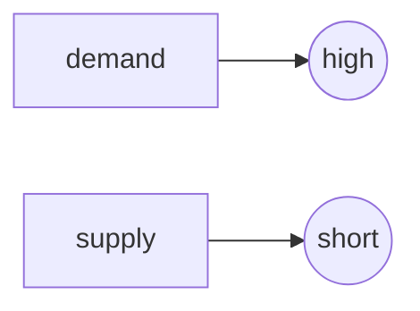

# Section III 14-22

## Unit-14 Specialization, Exchange and Money
### Specialization
<span id="specialization" />

#### Consequences of Specialization

##### Advantages of Specialising

1. Specialising allows countries to **concentrate on** what they are best at(1) influenced by factor endowment(1)

2. specialisation can **reduce the (average) costs** of production (1) **raise productivity** (1) efficiency (1) **enabling lower prices** to be charged (1)

3. Specialisation could **increase export** revenue/**improve trade position** (1)

4. Specialisation can **increase output/income/GDP** (1)

5. Specialisation can **improve the quality** of output(1)

##### Specialization reduce cost
1. Workers can specialise in what they **are best at**(1) increasing **productivity**

2. Workers can be **trained quickly**(1) **cost** of training **reduced**(1)

3. **Less equipment** is needed(1) cutting the **cost** of amount of capital needed(1)

4. **Less time** needs to be taken in moving between tasks(1) **more time focused** on production(1)

5. It may be **easier** to **mechanise** the process(1) increase **productivity**(1)

6. Increased **efficiency**/higher quality production(1) **reduce wastage**(1)


**You can also see**

* [GDP](section5.md#gdp)


## Unit-15 Banks
<span id="banks" />

### Functions of central bank
1. May **set interest rates**/operates monetary policy (1) to influence the level of demand in the economy/**keep inflation rate** within target (1)

2. May **influence the exchange rate** (1) by **buying** and **selling** the **currency**/using **reserves**/changing the interest rate (1)

3. **Regulates the banking** system (1) it will try to ensure banks **follow sound policies** (1)

### Different between central banks and commercial banks
1. A central bank is the **bank of the government and commercial banks**(1) whereas a commmercial bank is the **bank of the firms and households**

2. A central bank **issues notes and coins** (1) which commercial banks **cannot do**(1)

3. A central bank **implements** monetary policies measures(e.g. change in rate of interest(1) whereas a commercial bank **responds** to monetary policy measurements(1)

4. A central bank is **owned by the government**(1) a commercial bank is ususally **privately owned**(1)

### Bank lending induces economic growth
1. An increase in bank lending to households may **increase consumer expenditure**(1) **higher** total demand(**AD**)(1) may encourage firms ot **increase** their **output**(1) this will increase **GDP**

2. An increase in bank lending may **increase investment**/spending on capital goods/expand business(1) this will increase **demand for capital** goods(1) it will also **increase** productive **capacity**(1) causing **potential economic growth**(1)

3. An increase in bank lending to people **undertaking education**(1) may increase labor **productivity**(1) increasing **GDP**(1) and **potential economic growth**

## Unit-16 Stock Exchange
<span id="" />
## Unit 17 Choice of Occupation
<span id="" />
### Why someone chooses low-wage jobs with little job security
- **Job satisfactio**n(1) some people undertake jobs because of the **pleasure** they gain from(e.g. nursing)
- **Working hours**(1) some people place a high value in **leisure**
- **Working condition**(1) **clean** working environment
- May not be able to take up a better job in another part of the country/geographical **immobile**(1) due to family and housing cost
- Lack of qualification(1)some people may have no choice because they are not qualified enough to do better jobs
- Lack of skills(1)Worker may not be able to undertake the job required
- Lack of experience(1)employers expecting lower productivity
- Reluctance to accept responsibility (1) not wishing to take on a stressful job/position (1).
- Promotion chances (1) a worker may accept a low wage now in expectation of a high wage in the future (1).
- Fringe benefits (1) such as a company car given to a sales person (1).
- Some workers may be forced to accept such jobs because of lack of skills (1) high rate of unemployment (1) cut in or lack of unemployment benefits(1).
- Lack of awareness of availability of better paid more secure jobs (1).

##Unit-18 Difference in Earning

####Why some people earning more

1. Skilled->productive
2. Qualified
3. The demand for labor is high.(1) Demand for services is more **elastic** (2)
4. The supply for labor is short.(1) Supply is more **inelastic** (2)

```flow
st=>start: Start
e=>end: End

st->e

```



5. Belong to trade union(1) Large bargaining power (2)

**You may also see**

* [Opportunity cost](#trade_union)


##Unit-19 Change in Earning
<span id="" />
##Unit-20 Trade Union
<span id="trade_union" />


##Unit-21 Motives for Spending Saving and Borrowing
<span id="" />
##Unit-22 Expenditure Patterns
<span id="expenditure_patterns"></span>

###Different spending patterns between young and old
- Young workers may spend more as they may not have a family to save for(1) older workers may spend a smaller proportion of their income(1) as they may be paid more and so can afford to save(1)
- Young workers may save more to purchase a house(1) older workers may have sufficient savings(1)
- Younger workers may spend more on high-tech products(1) older workers more on healthcare(1)
- Young workers may save less as they do not have sufficient income(1) older workers may save more as they are preparing for their retirement(1)
- Young workers may borrow more because they may be buying a car/house(1)
- Young workers may borrow less because the banks may be more reluctant to lend to young workers(1)


